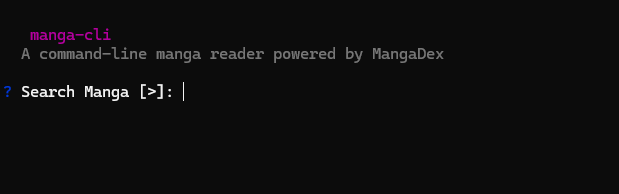

<div align="center">
  <br />
  <h1>📖 MangaCLI</h1>
  <br />
  <p><strong>Your favorite manga, right from your terminal.</strong></p>
  <p>A powerful command-line tool to search, browse, and read manga from MangaDex.</p>
  <br />
  <p>
    
    
    
  </p>
</div>

---

## ✨ Features

- **⚡️ Interactive & Quick Search**: Instantly search for any manga from MangaDex's vast library.
- **📖 Detailed Manga Info**: View manga details, including description, status, genres, and tags.
  
- **📚 Seamless Chapter Navigation**: Easily browse through chapter lists with pagination support.
  
- **🖥️ Comfortable Reading**: Opens chapters directly in your default web browser for an optimal reading experience.

  

- **🎨 Themed & Colorful Interface**: Enjoy a visually appealing and easy-to-navigate terminal UI.
- **🌐 Cross-Platform**: Works flawlessly on Windows, macOS, and Linux.

---

## ⚠️ Limitations

- **External Chapter Hosting**: Some manga chapters may not be directly viewable within MangaCLI. This is because they are hosted on external platforms (e.g., MangaPlus) that are not supported by the MangaDex API, which MangaCLI exclusively uses. When such chapters are encountered, MangaCLI will inform you and, if possible, provide a direct link to the external source for you to open in your browser.

---

## Prerequisites: First-Time Setup

For MangaCLI to work, your computer needs **Node.js**. If you don't have it, here’s a simple guide to get set up.

### What is Node.js and why do I need it?

Think of Node.js as an engine that lets your computer run this application.

The main reason you need to install Node.js is that it comes with **npm** (Node Package Manager). **npm** is the tool that actually downloads and installs `mangareader-cli` from the internet onto your computer.

So, the path is: **Install Node.js** → **Get npm automatically** → **Use npm to install MangaCLI**.

### How to Install Node.js

1.  **Go to the official Node.js website:** [nodejs.org](https://nodejs.org/en/download/)
2.  **Download the installer:** Choose the **LTS** (Long-Term Support) version for your operating system (e.g., Windows Installer or macOS Installer). LTS is the most stable and recommended version for most users.
3.  **Run the installer:** Open the downloaded file and follow the on-screen instructions. You can safely accept the default options by clicking "Next" through the steps.
4.  **Verify the installation (Optional):** Once installed, you can open your terminal (Command Prompt on Windows or Terminal on macOS) and type `node -v`. If it shows a version number, you're all set!

---

## 🚀 Installation

To get started, you need to have Node.js and npm installed. Then, install MangaCLI globally:

```bash
npm install -g kiraa0098/mangareader-cli
```

_(Note: You might need to publish the package to npm first!)_

---

## 🎮 How to Use

**Note:** We use `npx` to run the CLI. This ensures that you are always using the latest version of the tool without having to worry about global installation paths.

There are two ways to use MangaCLI:

### 1. Interactive Mode

Simply run the command without any arguments to enter the interactive search prompt:

```bash
npx kiraa0098/mangareader-cli
```



You will be guided through the process of searching, selecting a manga, and choosing a chapter.

### 2. Direct Search

Provide a search query directly as an argument to see results immediately:

```bash
npx mangareader-cli "naruto"
```


### Navigation

- Use the **arrow keys** (↑/↓) to navigate lists.
- Press **Enter** to make a selection.
- Follow the on-screen prompts for actions like going to the next/previous page, viewing chapters, or exiting.

---

## 📦 Tech Stack

- [Node.js](https://nodejs.org/)
- [TypeScript](https://www.typescriptlang.org/)
- [MangaDex API](https://api.mangadex.org/docs/)
- [Commander.js](https://github.com/tj/commander.js/) for command-line arguments.
- [Inquirer](https://github.com/SBoudrias/Inquirer.js/) for interactive prompts.
- [Axios](https://axios-http.com/) for making API requests.
- [Chalk](https://github.com/chalk/chalk) for terminal styling.
- [Ora](https://github.com/sindresorhus/ora) for loading spinners.

---

## 🤝 Contributing

Contributions are welcome! If you have ideas for new features or find any bugs, feel free to open an issue or submit a pull request.

1. Fork the repository.
2. Create your feature branch (`git checkout -b feature/AmazingFeature`).
3. Commit your changes (`git commit -m 'Add some AmazingFeature'`).
4. Push to the branch (`git push origin feature/AmazingFeature`).
5. Open a Pull Request.

---

## 📄 License

This project is licensed under the ISC License.
